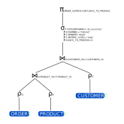

Σχεδίαση Βάσεων Δεδομένων και Κατανεμημένες ΒΔ
==============================================

Ερώτημα 1 - Δημιουργία και γέμισμα σχήματος
-------------------------------------------

**Κώδικας:**

.. literalinclude:: ../scripts/ex1.sql
   :linenos:
   :lines: 1-42, 49-106

**Παραδοχές:**

Στον πίνακα ``ORDERS`` πήραμε ``AVG`` τιμές
ώστε να υπάρχει μοναδικός συνδυασμός
``ORDER_ID, PRODUCT_ID``.

Ερώτημα 2 – Εντοπισμός ζημιογόνων παραγγελιών
---------------------------------------------

*i) Για κάθε παραγγελία βρείτε τη μέγιστη καθυστέρηση εκτέλεσης σε ημέρες
λαμβάνοντας υπόψη ότι η καθυστέρηση μετρά μετά τις 10 πρώτες ημέρες
(days_to_process>10 για το σύνολο των προϊόντων της παραγγελίας).*

**Κώδικας:**

.. literalinclude:: ../scripts/ex2.sql
   :lines: 2-3

*ii) Υπολογίστε το τελικό κέρδος της αφού πρώτα αφαιρέσετε
(ανά προϊόν) από την τιμή πώλησης (price) την τιμή κόστους
(cost) και για κάθε ημέρα καθυστέρησης της εκτέλεσης
επιπλέον το 0.0001 της τιμής καταλόγου (list_price).*

**Κώδικας:**

.. literalinclude:: ../scripts/ex2.sql
   :lines: 6-8

*iii) Δημιουργήστε έναν cursor που να διατρέχει τις παραγγελίες και
να υπολογίζει ανά παραγγελία το τελικό κέρδος (για όλα τα προϊόντα της),
στη συνέχεια να ελέγχει αν το κέρδος είναι αρνητικό ή θετικό.
Στην περίπτωση ι) που είναι αρνητικό να καταχωρει σε ένα πίνακα
deficit τα (orderid,customerid,channel,amount) όπου η amount
θα έχει τη ζημιά με θετικό πρόσημο, ιι) που είναι θετικό να καταχωρεί
σε ένα πίνακα profit τα αντίστοιχα orderid,customerid,channel,amount.*

**Κώδικας:**

.. literalinclude:: ../scripts/ex2.sql
   :lines: 12-17, 20-49

*iv) Ποια τα συνολικά έσοδα και ζημιές σε παραγγελίες
που έγιναν από άνδρες και γυναίκες αντίστοιχα;*

**Κώδικας:**

.. literalinclude:: ../scripts/ex2.sql
   :lines: 52-59

**Αποτέλεσμα:**

.. csv-table::
   :header: CUSTOMER_GENDER,TOTAL_PROFIT,TOTAL_DEFICIT
   :widths: 15,15,15

   Male,1288541.18,58107.68
   Female,856590.6,36187.7

*v) Ποια τα συνολικά έσοδα και ζημιές ανά κανάλι παραγγελιών;*

**Κώδικας:**

.. literalinclude:: ../scripts/ex2.sql
   :lines: 66-72

**Αποτέλεσμα:**

.. csv-table::
   :header: ORDER_CHANNEL,TOTAL_PROFIT,TOTAL_DEFICIT
   :widths: 15,15,15

   Direct Sales,1026668.39,41957.73
   Partners,612302.71,29623.31
   Internet,506160.68,22714.34

Ερώτημα 3 - Βελτιστοποίηση ερωτήματος ισότητας
----------------------------------------------

Χρησιμοποιώντας την εντολή EXPLAIN ελέγξτε πώς
λειτουργεί ο optimizer για το ακόλουθο ερώτημα:

.. literalinclude:: ../scripts/ex3.sql
   :lines: 9-17

*1) Σύμφωνα με την EXPLAIN ποιο είναι το εκτιμώμενο συνολικό κόστος
για την εκτέλεση του καλύτερου πλάνου για το ερώτημα αυτό;
Ποια τα CPU_COST και IO_COST; Ποια είναι η πιο χρονοβόρα ενέργεια;*

| Το εκτιμώμενο συνολικό κόστος για το ερώτημα είναι **868**.
| Τα **CPU_COST** και **IO_COST** είναι **205864078**
   και **863** αντίστοιχα.
| Η ποιο χρονοβόρα ενέργεια είναι η εκτέλεση **TABLE ACCESS FULL**
   στον πίνακα **ORDERS** με κόστος **786**.

*2) Ποιο είναι το εκτιμώμενο πλήθος αποτελεσμάτων για το ερώτημα;
Πόσες πλειάδες επιστρέφει πραγματικά το ερώτημα;
Χρησιμοποιώντας συμβολισμούς σχεσιακής άλγεβρας,
σχεδιάστε το πλάνο εκτέλεσης που επέλεξε ο optimizer.*

Το εκτιμώμενο πλήθος αποτελεσμάτων για το ερώτημα είναι **883**,
ενώ τελικά επιστρέφει **105** πλειάδες.

   Πλάνο εκτέλεσης

*3) Ποιο το τελικό κόστος μετά τη βελτιστοποίηση της σχεδίασης;*

.. literalinclude:: ../scripts/ex3.sql
   :lines: 60-63

| Αφού υλοποιήσαμε τα παραπάνω ευρετήρια,
   το τελικό κόστος μειώθηκε σε **786**.
| Επίσης, τα **CPU_COST** και **IO_COST** μειώθηκαν
   σε **188418202** και **783** αντίστοιχα.

Ερώτημα 4 - Βελτιστοποίηση ερωτήματος ανισότητας
------------------------------------------------

Τι θα αλλάξει αν κάνετε το ακόλουθο ερώτημα;

.. literalinclude:: ../scripts/ex4.sql
   :lines: 3-15

*1) Σύμφωνα με την EXPLAIN ποιο είναι το εκτιμώμενο συνολικό κόστος για
την εκτέλεση του καλύτερου πλάνου χωρίς ευρετήρια για το ερώτημα αυτό;
Ποια τα CPU_COST και IO_COST; Ποια είναι η πιο χρονοβόρα ενέργεια;*

| Το εκτιμώμενο συνολικό κόστος για το ερώτημα είναι **868**.
| Τα **CPU_COST** και **IO_COST** είναι **211452900**
   και **863** αντίστοιχα.
| Η ποιο χρονοβόρα ενέργεια είναι η εκτέλεση **TABLE ACCESS FULL**
   στον πίνακα **ORDERS** με κόστος **786**.

*2) Επιχειρήστε να βελτιστοποιήσετε το ερώτημα δημιουργώντας τα κατάλληλα
ευρετήρια. Ποιο το τελικό κόστος μετά τη βελτιστοποίηση της σχεδίασης;*

| Χρησιμοποιώντας τα ίδια ευρετήρια με το προηγούμενο ερώτημα,
   το τελικό κόστος μειώθηκε σε **788**, ενώ τα **CPU_COST** και
   **IO_COST** μειώθηκαν σε **20093774** και **783** αντίστοιχα.
| Δεν παρατηρήσαμε κάποια περαιτέρω βελτίωση μετά την δημιουργία
   επιπλέον ευρετηρίων.

